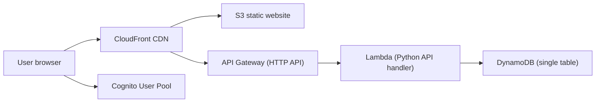

## Funkedupshift – Serverless Site Catalog

This repository contains a serverless web application you can use as a **shared catalog of websites** with:

- Site metadata (URL, title, description, tags, categories)
- Per-user ratings (1–5 stars), notes, and comments
- Optional scraped content (e.g. README/about text)
- Simple role-based access (admin / manager / user) for managing the catalog

You can fork or clone this repo and, with some basic AWS and GitHub setup, run **your own personal version** of the app.

### Architecture Overview

At a high level, the system looks like this:

- **Frontend:** Plain JavaScript/HTML/CSS in `src/web/`, served from an S3 static website bucket behind CloudFront.
- **API:** AWS API Gateway (HTTP API) calling a Python Lambda (`src/lambda/api/handler.py`) for all business logic.
- **Auth:** AWS Cognito User Pool (JWT authorizer in API Gateway); Cognito groups provide roles (`admin`, `manager`, `user`).
- **Data storage:** A single DynamoDB table (`PK`/`SK` with GSIs) for sites, users, ratings, comments, and groups.
- **Infrastructure:** Terraform under `infra/` defines all AWS resources, including IAM roles used by GitHub Actions.

### Environments and Branches

This repo is set up for **two environments**:

- **Staging** – Deployed from the `development` branch.
- **Production** – Deployed from the `main` branch.

On each push:

- GitHub Actions runs tests (`pytest` for Lambdas).
- Terraform in `infra/` applies changes to the appropriate environment.
- The frontend in `src/web/` is synced to the correct S3 website bucket.

For a more detailed explanation of the CI/CD and environment wiring, see:

- [`docs/ci-cd-and-environments.md`](docs/ci-cd-and-environments.md)
- [`docs/github-actions-setup.md`](docs/github-actions-setup.md)

### Getting Started (Quickstart)

If you want to spin up your own instance of this app:

1. **Review the quickstart guide:**  
   See [`docs/quickstart.md`](docs/quickstart.md) for a step-by-step walkthrough using generic placeholders like `<your-aws-profile>`, `<your-staging-website-bucket>`, and `<your-github-org>/<your-github-repo>`.
2. **Bootstrap Terraform state (once per AWS account):**  
   See [`docs/bootstrap-terraform-backend.md`](docs/bootstrap-terraform-backend.md).
3. **Customize Terraform variables:**  
   Adjust defaults in `infra/variables.tf` (bucket names, table name, Cognito names, domains) or override via `terraform.tfvars`.
4. **Create Cognito User Pool + app client:**  
   Follow [`docs/cognito-setup.md`](docs/cognito-setup.md) to wire up authentication.
5. **Wire GitHub Actions to AWS (optional but recommended):**  
   Configure OIDC-based deploys as described in [`docs/github-actions-setup.md`](docs/github-actions-setup.md).

### Documentation Map

Key docs (all Markdown) live under `docs/`:

- **Quickstart & overview**
  - [`docs/quickstart.md`](docs/quickstart.md) – Main “set up your own instance” guide.
  - [`docs/ci-cd-and-environments.md`](docs/ci-cd-and-environments.md) – How `development` → staging and `main` → production deployments work.
  - `docs/infrastructure-overview.md` – High-level description of the Terraform modules and AWS resources (to be kept in sync with `infra/`).
- **Infrastructure & deployment**
  - [`docs/bootstrap-terraform-backend.md`](docs/bootstrap-terraform-backend.md) – Creating the S3 + DynamoDB backend for Terraform state.
  - [`docs/github-actions-setup.md`](docs/github-actions-setup.md) – Wiring GitHub Actions to assume AWS roles via OIDC.
  - [`docs/custom-domains.md`](docs/custom-domains.md) – Example custom domain + CloudFront + Route 53 configuration.
  - [`docs/cognito-setup.md`](docs/cognito-setup.md) – Setting up Cognito for auth and roles.
- **Application internals**
  - [`docs/data-model.md`](docs/data-model.md) – DynamoDB single-table design and GSIs.

Existing funkedupshift-specific details (domains, bucket names, etc.) are preserved in the docs as **examples** so you can see one concrete configuration while substituting your own values like `<your-root-domain>` and `<your-s3-bucket-name>`.

