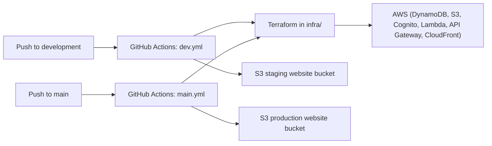

## CI/CD and Environments

This project is set up with **two environments** driven by Git branches and GitHub Actions:

- **Staging** – built and deployed from the `development` branch.
- **Production** – built and deployed from the `main` branch.

### High-Level Flow

Both workflows:

1. Check out the repo.
2. Configure AWS credentials via OIDC using a role ARN from repository variables.
3. Install Python + test dependencies and run Lambda unit tests.
4. Set up Terraform and run `terraform init`, `plan`, and `apply` in the `infra/` directory.
5. Use Terraform outputs to generate `src/web/config.js` (API URL and Cognito IDs).
6. Sync the frontend to the appropriate S3 website bucket.

### Staging (development branch)

Workflow file: [`.github/workflows/dev.yml`](../.github/workflows/dev.yml)

- **Trigger:** Push to `development`.
- **AWS role:** `${{ vars.AWS_ROLE_ARN_STAGING }}`.
- **Region:** `${{ vars.AWS_REGION || 'us-east-1' }}`.
- **Terraform:** Runs against the same state backend but uses `githubOrgRepo=${{ github.repository }}` to tie IAM/OIDC trust to your fork.\n- **Frontend deploy target:** Terraform output `websiteStagingBucket` (defaults to `<your-staging-website-bucket>`).

Use this environment for testing changes before merging to `main`.

### Production (main branch)

Workflow file: [`.github/workflows/main.yml`](../.github/workflows/main.yml)

- **Trigger:** Push to `main`.
- **AWS role:** `${{ vars.AWS_ROLE_ARN_PRODUCTION }}`.
- **Region:** `${{ vars.AWS_REGION || 'us-east-1' }}`.
- **Terraform:** Same steps as staging, applying any changes for production.
- **Frontend deploy target:** Terraform output `websiteProductionBucket` (defaults to `<your-production-website-bucket>`).

This environment should host the \"live\" version of your catalog.

### Required GitHub Variables

In GitHub, under **Settings → Secrets and variables → Actions → Variables**, define:

| Name                    | Description                                                   |
|-------------------------|---------------------------------------------------------------|
| `AWS_ROLE_ARN_STAGING`  | IAM role ARN for staging deploys (Terraform + S3 sync).      |
| `AWS_ROLE_ARN_PRODUCTION` | IAM role ARN for production deploys.                       |
| `AWS_REGION`            | (Optional) AWS region, defaults to `us-east-1` if omitted.   |

The Terraform code in `infra/` exports the staging/production role ARNs; see:

- [`docs/github-actions-setup.md`](github-actions-setup.md)

for details on how to obtain and configure them.

### Local vs CI Deployments

You can always run Terraform and deploy the frontend manually from your machine, but GitHub Actions provides a repeatable pipeline:

- **Local:** Good for experimentation, debugging, and first-time setup.
- **CI/CD:** Good for day-to-day development once your roles and variables are configured.

If you change Terraform or infrastructure behavior, keep this document and the workflow files in sync so future users understand the deployment model.

