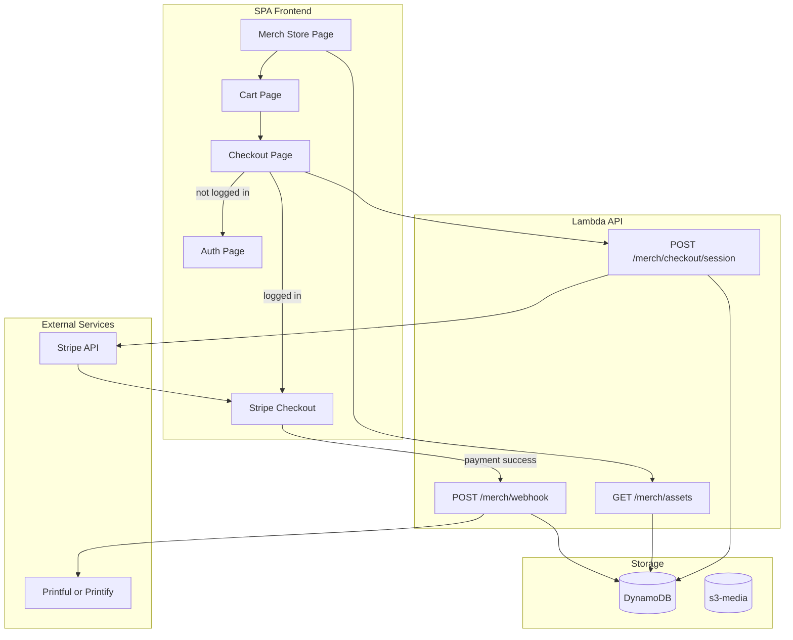

# Merch Store Module Plan

## Overview

Add a low-friction merchandise store module where users browse assets, select product types (shirt/hoodie/hat/mug), add to cart, and checkout via Stripe. Auth required only at checkout. Admin/manager manage assets; fulfillment via **Printful** (primary) or **Printify** (alternative).

---

## What You Need to Consider

### 1. Fulfillment Engine: Printful (Primary) or Printify

**Printful** (developers.printful.com) – **Recommended primary choice**

- Full-featured REST API with comprehensive docs, Postman collection, and Python SDK (pyPrintful)
- Catalog API, Orders API, Mockup Generator API, Shipping & Tax APIs, Webhooks
- Consistent product quality; widely regarded as top choice for custom integrations
- Private API tokens or OAuth 2.0; straightforward for Lambda/serverless

**Printify** (developers.printify.com) – **Easiest alternative**

- Noted for "exceptional ease of use"; simpler setup
- REST API with code examples in cURL, Node, Python, PHP
- Shop management, product creation, order management, catalog, file uploads
- Rate limits: 600 req/min global; 100 req/min for Catalog

**VistaPrint** – Not recommended for initial build; API access requires contacting a rep and docs target cinema/enterprise use cases. Can be added later if needed.

### 2. Auth Gate Strategy

- **Browse, add to cart:** No auth required (guest-friendly)
- **Checkout:** Require Fus login (any Cognito role: user, manager, superadmin)
- **Flow:** User adds items → clicks Checkout → if not logged in, redirect to `/auth?returnUrl=/merch/checkout` → after sign-in, return to checkout
- Use `AuthPage` with `returnUrl` query param (may need a small enhancement to redirect after sign-in)

### 3. Cart State

- **Client-side cart:** `localStorage` key `funkedupshift_merch_cart` (JSON array of line items)
- **Header behavior:** If cart empty → show "Store" link; if cart has items → show cart icon + badge with count
- Cart persists across sessions; merge with user on checkout (optional: sync cart to backend for logged-in users)

### 4. Data Model (DynamoDB Single Table)

| Entity                 | PK               | SK                  | Attributes                                                                                                  |
| ---------------------- | ---------------- | ------------------- | ----------------------------------------------------------------------------------------------------------- |
| Merch asset            | MERCH#ASSET#id   | METADATA            | assetKey (S3), title, entityType, entitySk, createdAt, updatedAt, uploadedBy                                |
| Merch product template | MERCH#PRODUCT#id | METADATA            | type (shirt/hoodie/hat/mug), basePriceCents, fulfillmentSku (Printful/Printify variant ID), entityType, entitySk |
| Merch order            | MERCH#ORDER#id   | METADATA            | userId, items (list), totalCents, stripeSessionId, status, fulfillmentStatus, trackingUrl, shippingAddress, createdAt |
| User orders index      | USER#id          | MERCH#ORDER#orderId | For "my orders" query                                                                                       |

**GSI:** Add `byEntity` query for `entityType=MERCH_ASSET` and `entityType=MERCH_PRODUCT` if not already covered by existing GSI.

### 5. Stripe Integration

- **Create Checkout Session:** Lambda `POST /merch/checkout/session` (auth required)
  - Input: `{ items: [{ assetId, productType, quantity }], successUrl, cancelUrl }`
  - Validate items, compute total, create Stripe Checkout Session with `line_items`
  - Return `{ sessionId, url }` – frontend redirects to Stripe
- **Webhook:** Lambda `POST /merch/webhook` (Stripe signature verification, no auth)
  - On `checkout.session.completed`: create MERCH#ORDER, trigger fulfillment (Printful or Printify API)
- **Secrets:** Store `STRIPE_SECRET_KEY` and `STRIPE_WEBHOOK_SECRET` in Lambda env (Terraform `aws_secretsmanager_secret` or SSM)

### 6. Product Flow (Low Friction)

Emulate top performers (Custom Ink, VistaPrint, Zazzle per Baymard):

1. **Store landing** (`/merch`) – grid of available assets (admin-uploaded images)
2. **Product configurator** – click asset → modal/page: choose product type (shirt/hoodie/hat/mug), size, quantity
3. **Add to cart** – stay on page (no forced navigation to cart)
4. **Cart** – slide-out or `/merch/cart` with clear line items, pricing, edit/remove
5. **Checkout** – auth gate here; then Stripe Checkout redirect
6. **Order history** – logged-in users see "My Orders" with current order status and full order history

### 7. Frontend Structure

```
src/web/spa/src/features/merch/
├── MerchStorePage.tsx       # Browse assets, product configurator
├── MerchCartPage.tsx        # Cart view (optional; could be slide-out)
├── MerchCheckoutPage.tsx    # Auth gate + redirect to Stripe
├── MerchSuccessPage.tsx     # Post-payment confirmation (shows current order status)
├── MerchOrderHistoryPage.tsx # Order history + current order status (auth required)
├── MerchContext.tsx         # Cart state (localStorage + React context)
└── admin/
    └── MerchAdminPage.tsx   # Single page with tabs
```

**MerchAdminPage tabs:**

- **Assets** – upload/manage merch assets (reuse presigned URL pattern from branding/media)
- **Products** – manage product templates (shirt, hoodie, hat, mug) with base prices and Printful/Printify variant IDs
- **Orders** – list orders, status, fulfillment tracking

### 8. API Routes (Lambda)

| Method  | Path                    | Auth       | Purpose                         |
| ------- | ----------------------- | ---------- | ------------------------------- |
| GET     | /merch/assets           | none       | List merch assets (public)      |
| GET     | /merch/products         | none       | List product templates (public) |
| POST    | /merch/checkout/session | required   | Create Stripe Checkout Session  |
| POST    | /merch/webhook          | Stripe sig | Handle payment completion       |
| GET     | /merch/orders           | required   | List current user's orders (order history) |
| GET     | /merch/orders/:id       | required   | Get single order with current status      |
| POST    | /merch/assets/upload    | manager+   | Presigned URL for asset upload  |
| POST    | /merch/assets           | manager+   | Create asset record             |
| PUT     | /merch/assets           | manager+   | Update asset                    |
| DELETE  | /merch/assets           | manager+   | Delete asset                    |
| GET/PUT | /merch/admin/products   | manager+   | Manage product templates        |
| GET     | /merch/admin/orders     | manager+   | List all orders (admin)         |

### 9. Prominent Store Promotion

- **Home page:** Add a prominent CTA section (e.g. gradient card) above or beside the hero: "Shop Funked Up Shift merch – hoodies, hats, mugs"
- **Header:** Store link or cart button (see below)
- **Discover section:** Add "Store" as the **first** nav item in the discover list
- **Footer:** Add Store link

### 10. Current Order Status & Order History

- **Current order status:** After checkout, success page shows the new order with status (e.g. "Processing", "Shipped"). Single order detail (`GET /merch/orders/:id`) returns `status`, `fulfillmentStatus`, `trackingUrl`.
- **Order history:** `/merch/orders` page (auth required) lists all user orders, newest first. Each row shows order date, items summary, total, and current status. Click to expand or navigate to order detail.
- **Discover nav:** Add "My Orders" link for logged-in users (in discover section or under Store).

### 11. Header Cart / Store Link

- **Empty cart:** Show "Store" link (text or icon) in header next to Sign in / user info
- **Non-empty cart:** Show cart icon (e.g. `ShoppingBagIcon`) with badge showing item count; click → `/merch/cart`
- Implement via `MerchContext` providing `cartItemCount`; consume in `AppLayout` header

### 12. Terraform / Infrastructure

- Lambda: Add `stripe` Python package to `requirements.txt` (or new `lambda/merch` layer)
- Env vars: `STRIPE_SECRET_KEY`, `STRIPE_WEBHOOK_SECRET`, `STRIPE_PUBLISHABLE_KEY` (frontend via config)
- API Gateway: Add routes for `/merch/*` and `/merch/webhook` (webhook may need public access, no Cognito authorizer)
- Webhook: Use raw body for Stripe signature verification (API Gateway must pass through body)

### 13. Security and Compliance

- **PCI:** Stripe Checkout is hosted – no card data touches your app; PCI scope minimized
- **Webhook:** Verify `Stripe-Signature` header; never trust webhook payload without verification
- **Pricing:** Compute server-side; never trust client-supplied prices

### 14. Fulfillment Integration (Phase 2)

- After Stripe webhook confirms payment: call **Printful** or **Printify** API to create order
- Pass: asset image URL (from s3-media), product variant ID, size, quantity, shipping address
- Printful: Orders API (`POST /orders`); Printify: Order API (create order in connected shop)
- Store fulfillment ID and status in MERCH#ORDER for admin visibility

---

## Architecture Diagram



---

## Implementation Order

1. **Data model and API scaffolding** – DynamoDB items, Lambda routes, Terraform
2. **MerchContext and cart** – localStorage cart, header Store/cart UI
3. **Store page** – asset grid, product configurator, add to cart
4. **Stripe Checkout** – create session, webhook, order creation
5. **MerchAdminPage** – Assets tab (upload), Products tab, Orders tab
6. **Order history & current status** – MerchOrderHistoryPage, GET /merch/orders/:id, success page status
7. **Home page promo and nav** – Store in discover, header, footer, My Orders link
8. **Fulfillment** – Printful (or Printify) order creation from webhook
